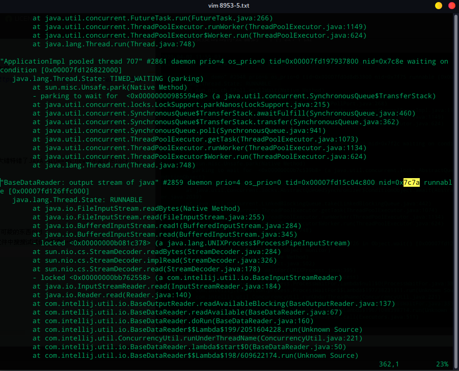

<p align="center">
  <a href="https://github.com/uncleyeung">
   
  </a>
</p>

<p align="center">
  为简化开发工作、提高生产率而生
</p>

<p align="center">
  
  <a href="https://github.com/996icu/996.ICU/blob/master/LICENSE">
    
  </a>

  <a href="https://www.apache.org/licenses/LICENSE-2.0">
    
  </a>
</p>

# uncleyeung's Repo For Cydia
> * Source: https://github.com/uncleyeung/uncleyeung.github.io/
> * Twitter: https://twitter.com/uncle_yeung
> * Tumblr: https://www.tumblr.com/blog/uncleyeung
# cpu飙高检查过程及其解决方案
#### 前言
+ 通过NIO读取文件内容模拟cpu持续跑高问题
+ 结果是已经确定的,通过cpu跑高反向检查异常线程栈
---
模拟CPU跑高代码, [详情参考见](https://github.com/uncleyeung/yeung-java-controller-test/blob/master/src/main/java/com/uncle/controller/nio/FileNioTest.java)


```java
/**
 * @author 杨戬
 * @className FileNioTest
 * @email uncle.yeung.bo@gmail.com
 * @date 20-4-2 10:50
 */
public class FileNioTest {
    public static void main(String[] args) {
        while (true) {
            try {
                RandomAccessFile rdf = new RandomAccessFile("/home/uncle/tmp/hello.txt", "rw");
                //利用channel中的FileChannel来实现文件的读取
                FileChannel inChannel = rdf.getChannel();
                //设置缓冲区容量为10
                ByteBuffer buf = ByteBuffer.allocate(10);
                //从通道中读取数据到缓冲区，返回读取的字节数量
                int byteRead = inChannel.read(buf);
                //数量为-1表示读取完毕。
                while (byteRead != -1) {
                    //切换模式为读模式，其实就是把postion位置设置为0，可以从0开始读取
                    buf.flip();
                    //如果缓冲区还有数据
                    while (buf.hasRemaining()) {
                        //输出一个字符
                        System.out.print((char) buf.get());
                    }
                    //数据读完后清空缓冲区
                    buf.clear();
                    //继续把通道内剩余数据写入缓冲区
                    byteRead = inChannel.read(buf);
                }
                //关闭通道
                rdf.close();
            } catch (IOException e) {
                e.printStackTrace();
            }
            //Thread.sleep(1000);
        }
    }
}
``` 
+ 运行main方法
---
+ 现在先来分析一下cpu的情况,可以看到pid:8953和pid:15268 cpu的占用率达到了106.3%和98.3%,此时已经达到了我们的预期cpu高位骚走.


---
+  现在通过[top -H -p 8953] 或者 [ps -mp 8953 -o THREAD,time,tid] 查看当前线程组的情况,可以看到pid:31866/9000/32347持续跑高,怎么定位呢?怎么知道是哪个java的方法的哪个线程吗?


---
1. 既然我们知道线程组pid,我们可以通过他去定位问题,拿线程31866为例
2. 我们需要将10进制的31866转成16进制得到7c7a,对之后的确定java堆栈日志起到关键性作用
3. 堆栈信息怎么看?我们可以借助jstack 指令得到堆栈信息,如下图 [jstack详情参考](https://www.iteye.com/blog/guafei-1815222)
4. jstack pid >pid-x.txt


---
+ 查看刚才生成8953-5.txt文件,看到了们最熟悉的画面[方法 nid 线程状态 栈信息]
+ 看到这里我们可以看到epoll,延伸一下我为什么选择这种java nio的场景呢?
+ 前几天和同事讨论起NIO,同事的理解是NIO=非阻塞的IO(NOBlocking IO),这实际上就是大错特错了JAVA NIO==>N:new而不是NOBlocking
+ 从at sun.nio.ch.EPoll.epollWait(Native Method),可以得到证实(说了几句废话)
+ NIO(选择器 通道 缓存 聚散)


---
+ 刚才说道一个在之后很有用的10==>16进制的转换很重要,我们这时候可以看到里面有个很可可疑的东西nid
+ 就算你不知道他是什么,我们可以偷偷试试,拿刚才10进制的31866转成16进制得到7c7a在文件中搜搜试试你会看到一个什么?下图




+ 此时可以看到一个[BaseDataReader: output stream of java] [nid:0x7c7a] [线程state:RUNNABLE]
+ 再往下看你知道了,原来是这个方法[java.io.FileInputStream.readBytes(Native Method)]使得我们CPU变的如此之高,
+ 就此你学会了吗?
---
以上排查过程,可以帮助你在生产环境出现cpu/内存高位骚走等问题,快速定位/快速解决提供一点点思路